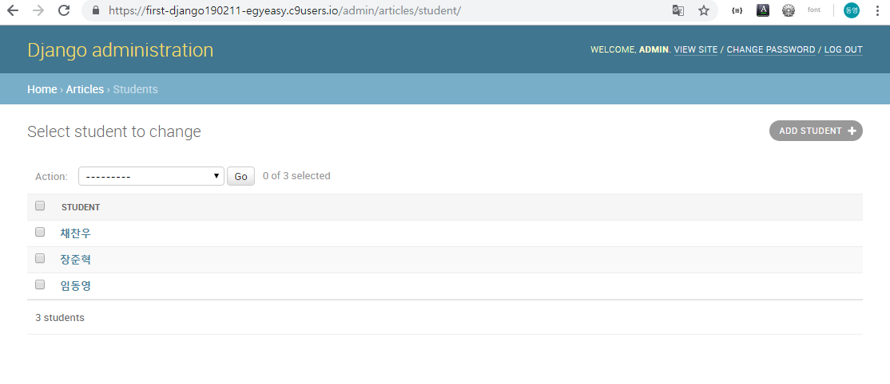

# 17homework

1. migration

2. max_length

3.  `$ python manage.py shell`

4. ### models.py

   ```python
   from django.db import models
   
   class Post(models.Model):
       title = models.CharField(max_length=50)
       content = models.CharField(max_length=300)
   ```

   ### InteractiveConsole

   ```python
   info = Post(title="임동영", content="dz1120@gmail.com")
   info.save()
   ```


# 17workshop

### models.py

```python
from django.db import models

class Student(models.Model):
    name = models.CharField(max_length=20)
    email = models.CharField(max_length=50)
    birthday = models.DateField()
    age = models.IntegerField()
    
    def __str__(self):
        return self.name
```


`$ python manage.py makemigrations`

`$ python manage.py migrate`


### admin.py

```python
from django.contrib import admin
from .models import Student

# Register your models here.
admin.site.register(Student)
```





